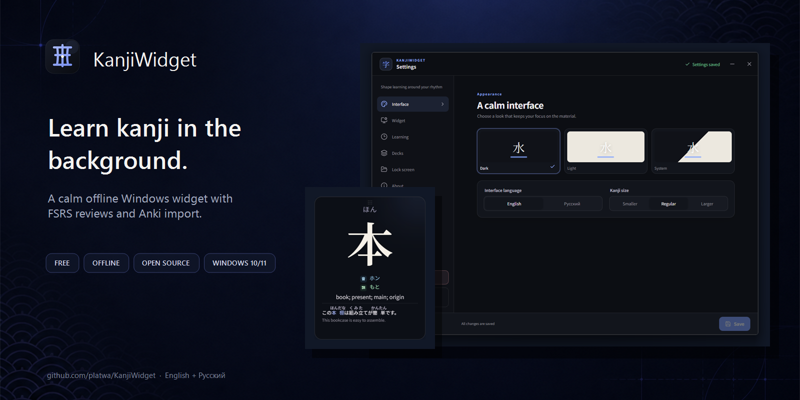
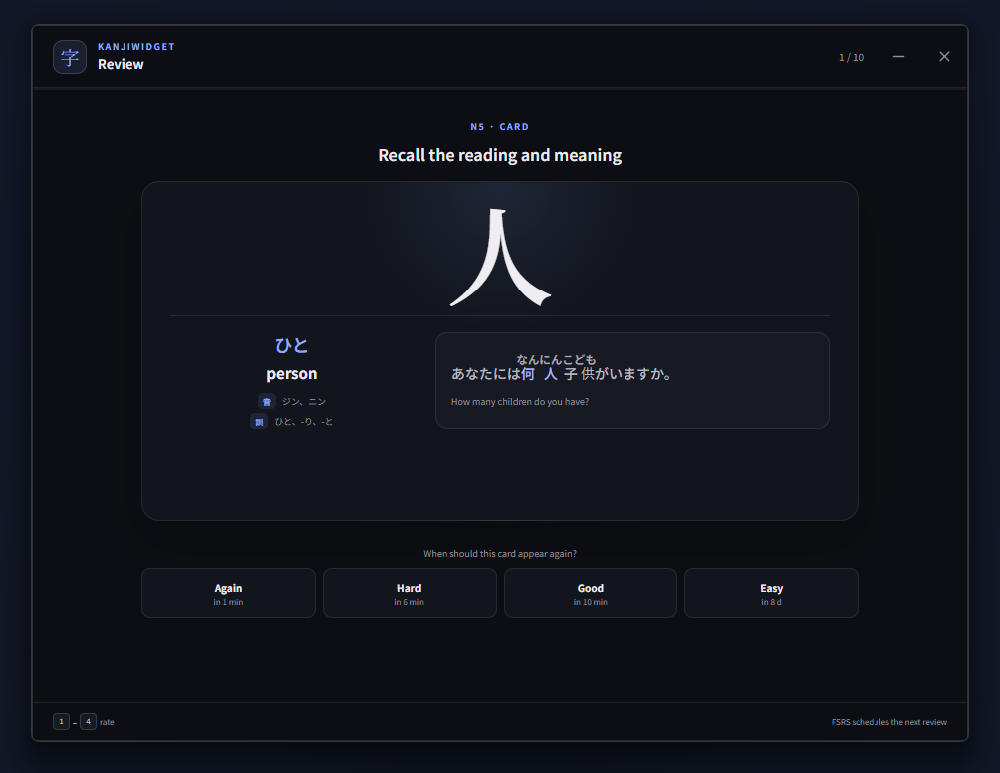
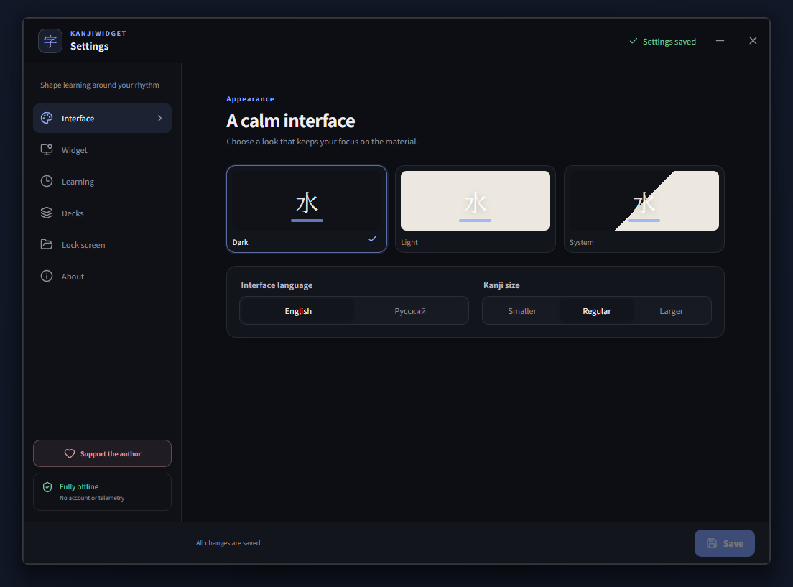
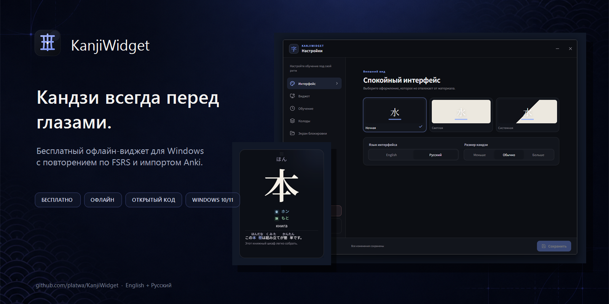

# KanjiWidget

<p align="center">
  
</p>

<p align="center">
  <a href="https://github.com/platwa/KanjiWidget/releases/download/v1.4.0/KanjiWidget-1.4.0-x64-Setup.exe"><strong>Download for Windows</strong></a>
  · <a href="https://github.com/platwa/KanjiWidget/releases/tag/v1.4.0">Release notes</a>
  · <a href="#русский">Русский</a>
</p>

KanjiWidget is a free, open-source Windows 10/11 app that keeps Japanese study cards quietly visible on your desktop and schedules reviews with FSRS. It works offline, requires no account, and is available in English and Russian.

> **Best for:** Japanese learners who want gentle background exposure to kanji without keeping Anki or a browser tab open all day.

## Features

- transparent desktop widget with automatic and manual card rotation;
- full-card, active-recall, and prompt display modes;
- built-in JLPT N5 (80 kanji) and JLPT N4 (170 kanji) decks;
- usage examples with furigana above kanji;
- Anki-style reviews: prompt and example → reveal answer → Again / Hard / Good / Easy;
- direct `.apkg` import into a separate deck without copying images or other media;
- manual card creation with immediate insertion into the current pool;
- fast search, editing, hiding, restoring, and deletion for large decks;
- local SQLite database for settings, progress, and review history;
- system tray, optional autostart, and the `Ctrl+Shift+J` global shortcut;
- dark, light, and system themes;
- 1920×1080 card export for the Windows lock-screen slideshow;
- no account, advertising, telemetry, or network access during normal use.

## See it in action

| Review with FSRS | Settings and themes |
| --- | --- |
|  |  |

The widget stays compact on the desktop, while Review and Settings open as focused full-size windows. Cards and progress remain on the computer in a local SQLite database.

## Widget controls

- Click: next card, or reveal hidden details in prompt and active-recall modes.
- `Ctrl` + click: previous card.
- Mouse wheel: move between cards.
- Hover: pause automatic rotation and reveal hidden details in active-recall mode.
- Pencil next to pause: edit the current card.
- Settings control next to the pencil: open the full settings window.
- Right click: open Review, Settings, or exit.
- Drag the top area: move the widget.
- Drag the lower-right corner: resize it.

## Windows builds

Download published packages from [GitHub Releases](https://github.com/platwa/KanjiWidget/releases). The recommended option for most users is the per-user Setup executable.

The `output` directory contains three Windows x64 packages for version 1.4.0:

- `KanjiWidget-1.4.0-x64-Setup.exe` — recommended per-user installer;
- `KanjiWidget-1.4.0-x64.msi` — MSI package for managed deployment;
- `KanjiWidget-1.4.0-x64-Portable.exe` — portable build that requires no installation.

`SHA256SUMS-1.4.0.txt` contains SHA-256 checksums. Public releases are currently unsigned, so Windows SmartScreen and some heuristic scanners may warn about an unfamiliar publisher. The checksums and reproducible source build make the packages verifiable.

KanjiWidget is applying for **free code signing provided by [SignPath.io](https://signpath.io/), certificate by [SignPath Foundation](https://signpath.org/)**. After approval, official signed packages will be built only from this public repository by GitHub Actions; current packages remain unsigned.

## Privacy and trust

- normal study activity is fully offline;
- the app has no account system, ads, analytics, or telemetry;
- support, donation, and issue links open only when the user selects them;
- imported Anki data and review history remain in the local application database;
- release checksums are published alongside every Windows package.

See the full [privacy statement](PRIVACY.md), [security policy](SECURITY.md), and [code signing policy](CODE_SIGNING.md).

## Development

Requirements: Node.js 20+, pnpm, stable Rust, and Microsoft C++ Build Tools.

```powershell
pnpm install
pnpm test
pnpm build
pnpm tauri dev
pnpm tauri build
```

Tauri produces intermediate packages in `src-tauri/target/release/bundle/`. Release-ready local artifacts are copied to `output/`.

## Updating the built-in data

The data scripts expect `jlpt-kanji-dictionary` and `kanjidic2.xml.gz` in `tmp` and produce the compact offline dataset:

```powershell
python scripts/enrich_examples.py
python scripts/build_cards.py
python scripts/build_fonts.py
```

The generated JSON and subset WOFF2 fonts are included in the application, so users do not need to download study data.

## Support and bug reports

Report reproducible problems through [GitHub Issues](https://github.com/platwa/KanjiWidget/issues) or email [support.kanjiwidget@gmail.com](mailto:support.kanjiwidget@gmail.com). Please do not attach private Anki data.

KanjiWidget is free and open source. You can help fund continued development through the [official Tribute page](https://web.tribute.tg/d/PHT).

## License

KanjiWidget source code is licensed under the [Apache License 2.0](LICENSE). Third-party notices are listed in [THIRD_PARTY_NOTICES.md](THIRD_PARTY_NOTICES.md). Dictionary content derived from JMdict/KANJIDIC2 is distributed separately under CC BY-SA 4.0.

---

## Русский

<p align="center">
  
</p>

<p align="center">
  <a href="https://github.com/platwa/KanjiWidget/releases/download/v1.4.0/KanjiWidget-1.4.0-x64-Setup.exe"><strong>Скачать для Windows</strong></a>
  · <a href="https://github.com/platwa/KanjiWidget/releases/tag/v1.4.0">Описание релиза</a>
</p>

KanjiWidget — бесплатное приложение с открытым исходным кодом для Windows 10/11: оно показывает компактные карточки с японскими кандзи на рабочем столе и планирует повторения по алгоритму FSRS. Программа работает офлайн, не требует аккаунта, а язык переключается в разделе **Настройки → Интерфейс**.

Поддерживаются встроенные колоды JLPT N5/N4, импорт `.apkg` без изображений, собственные карточки, быстрый поиск и редактирование, режим активного вспоминания, повторение в стиле Anki, фуригана в примерах, экспорт для экрана блокировки и работа из системного трея. Аккаунт, реклама и телеметрия отсутствуют.

Сообщить об ошибке можно через [GitHub Issues](https://github.com/platwa/KanjiWidget/issues) или по адресу [support.kanjiwidget@gmail.com](mailto:support.kanjiwidget@gmail.com). Поддержать разработку можно на [официальной странице Tribute](https://web.tribute.tg/d/PHT). Исходный код распространяется по Apache License 2.0, а сведения о лицензиях данных находятся в [THIRD_PARTY_NOTICES.md](THIRD_PARTY_NOTICES.md).
